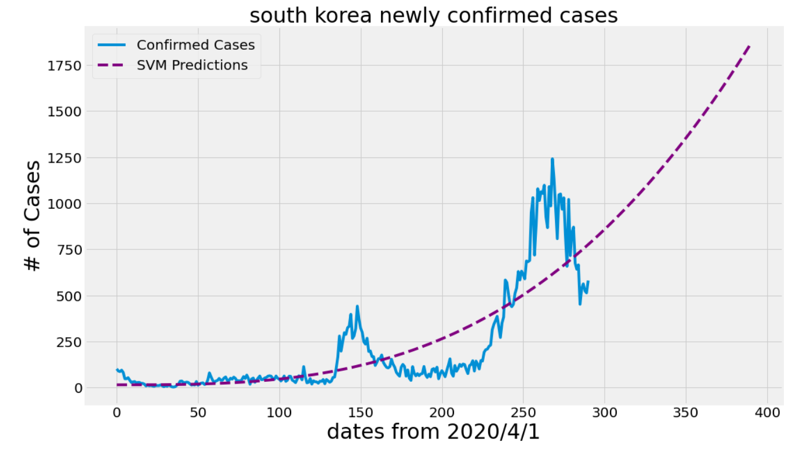

# Coronavirus Visualization and Prediction 
This repository tracks the spread of the novel coronavirus, also known as SARS-CoV-2. It is a contagious respiratory virus that first started in Wuhan in December 2019. On 2/11/2020, the disease is officially named COVID-19 by the World Health Organization.

This folk repo is focused to the COVID-19 confirmed cases in South Korea. It predicts for the next 100days from 2020/4/1. It uses Support Vector Machine to predict confirmed cases.

output image